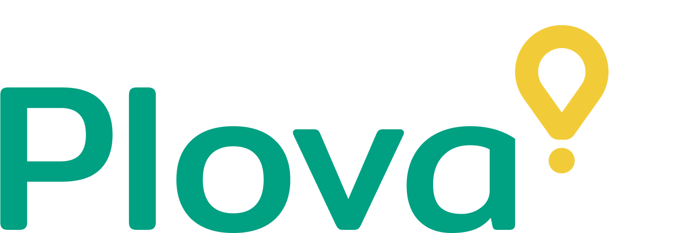

`Demo version of famous delivery application 'Glovo'`

####[Glovo](https://glovoapp.com/)

> **App presentation using development best practices like:**

1. JavaScript
2. React
3. Type Script
4. React Testing Library
5. Git and Github

---

**Libraries**

- [React Router](https://reactrouter.com/en/main)
- [Redux Toolkit](https://redux-toolkit.js.org/)
- [Axios](https://axios-http.com/)
- [Normalize.css](https://github.com/necolas/normalize.css/)
- [Styled Components](https://styled-components.com/)
- [React Hook Form](https://legacy.react-hook-form.com/)
<!-- - [Use Places Autocomplete](https://developers.google.com/maps/documentation/javascript/place-autocomplete) -->
- [React Use Geolocation](https://www.npmjs.com/package/react-hook-geolocation)
<!-- - [Geocoding](https://developers.google.com/maps/documentation/geocoding/overview) -->

**Design tools**

- [Figma](https://www.figma.com/)
- [Favicon](https://favicon.io/)
- [Snazzy Maps](https://favicon.io/)

**API's**

- Mock API Server(Temporary)
- Google Maps Platform:
  Geocoding API, Maps JavaScript API, Places API

**Collaboration**

- Cooperation with back-end developer to operate with server

---

Special thanks for the development of the back-end for the application and mentoring in the project to my mentor, senior software developer Andrew Danko

## How to start app?

- In progress..
